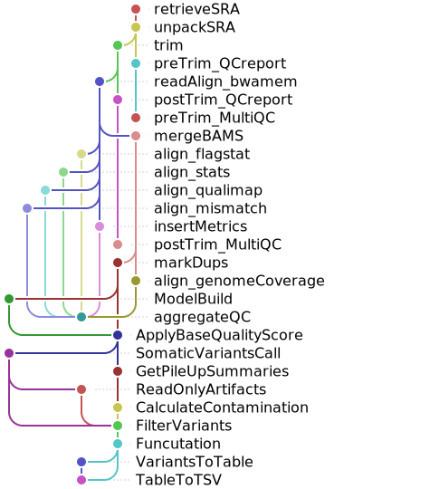

# wgs-pipeline-aws-parallelcluster
Terraform Infrastructure as Code (IaC) to Deploy an AWS HPC Cluster using AWS ParallelCluster for workflow parallelization using Snakemake SLURM.

***This setup automates the creation of a high-performance computing (HPC) environment for running a whole genome sequencing (WGS) pipeline. The pipeline is parallelized with Snakemake and managed using SLURM for job scheduling and resource allocation. SLURM accounting is enabled to track resource usage. The solution also includes AWS automation resources for seamless deployment and management of the infrastructure.***

***Plot built using Snakevision repo.***
